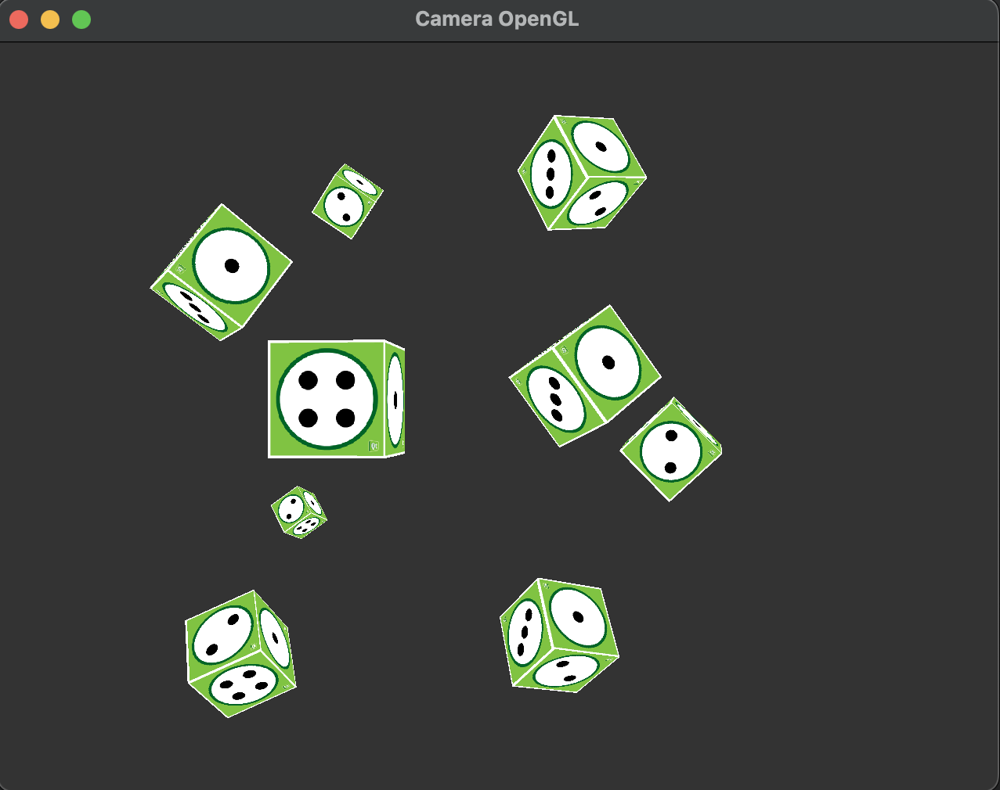

# Camera OpenGL Qt/C++
This project demonstrates the implementation of a 3D camera concept in an application utilizing OpenGL and the Qt framework in C++. 
The application showcases basic techniques for rendering a 3D scene and interacting with the camera, such as rotation, zoom, and panning.
This project based on [learnopengl-website](https://learnopengl.com/Getting-started/Camera) and [qt-example](https://doc.qt.io/qt-6/qtopengl-cube-example.html) projects.

## Screenshots


## Controls

|     Key       | Action        |
| ------------- | ------------- |
| w             | camera moves forward  |
| s             | camera moves backward |
| d             | camera moves right    |
| a             | camera moves left     |
| up            | camera moves up       |
| down          | camera moves down     |
| left          | camera turns left |
| right         | camera turns right |
| q             | camera turns up |
| e             | camera turns down |
| ESC           | app quits |

## How to run
* Clone the repository: `git clone https://github.com/Przemekkkth/camera-opengl-qt.git`
* Navigate to the project directory: cd your-repository
* Configure and build the project:
```
mkdir build
cd build
qmake ..
make
./your-executable
```

## Addons
* [Qt](https://www.qt.io/) - cross-platform software for embedded & desktop
* [learnopengl.com](https://learnopengl.com) - great website with series of OpenGL tutorials
